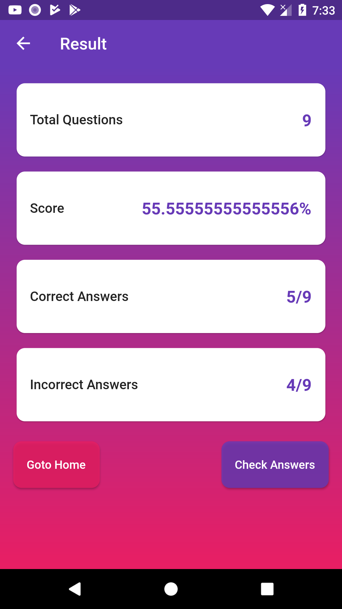
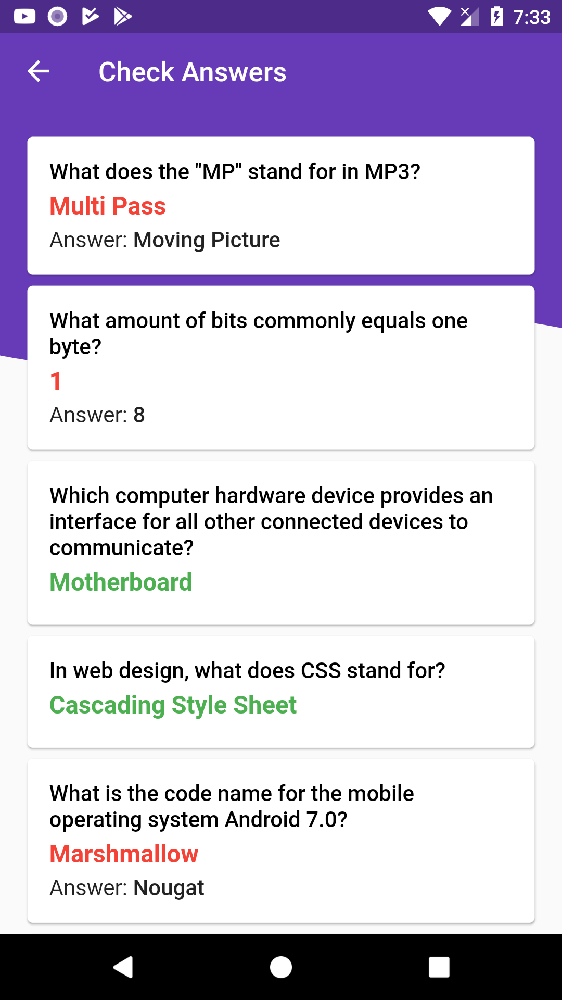

# Flutter UI Challenges

### Table of contents
- **[Animation Examples UI](#animations)**
- **[Ecommerce UIs](#ecommerce)**
- **[Login/signup UIs](#user-flow-screens)**
- **[Settings UIs](#settings-uis)**
- **[Dashboard UIs](#dashboard-uis)**
- **[Quotes App UIs](#quotes-app-uis)**
- **[Motorbike App UIs](#motorbike-app-uis)**
- **[Profile UIs](#profile-screens)**
- **[Invitation App UIs](#inviation-app-ui)**
- **[Lists UIs](#lists-uis)**
- **[Navigation UIs](#navigations)**
- **[Onboarding UIs](#onboarding-screens)**
- **[Miscellaneous UIs](#miscellaneous-widgets)**
- **[Blog UIs](#blog)**
- **[Food App UIs](#food-app)**
- **[Quiz App UIs](#quiz-app)**
- **[Todo App UIs](#todo-app)**
- **[Hotel App UIs](#hotel-app)**
- **[Travel App UIs](#travel-app)**
- **[Grocery App UI Kit](#grocery-app-ui-kit)**
- **[Bank App Clone](#bank-app-clone)**
- **[Furniture App UI](#furniture-app-ui)**

 

 

## Ecommerce
// ---> Nhân
 
 

// ---> Long
 

 

// --> Bão
 
 

// ---> Khoa

 

## User Flow Screens

// Bão - login1
 
 
 
 
 

// Khoa - login2
 
 
 
 
 

// Long - login3
 
 
 
 

// Nhân - login4
 
 
 
 

## Settings UIs
// Khoa - settingUIs1
 

// Bão - settingUIs2
 
 

// Long - settingUIs3
 

// Nhân - settingUIs4

## Profile Screens

/// Bão Profile_Screens1 

 

/// Long Profile_Screens2

 

/// Khoa Profile_Screens3

/// Nhân Profile_Screens4

## Todo App
// Bão
 

// Nhân

// Long

// Khoa

## Dashboard UIs  <1/8/2022>

 Nhân
 Bão
 Long

## Quotes App UIs
 Khoa
 Khoa

## Motorbike App UIs
Khoa
Khoa
 Khoa

## Inviation App UI

 Khoa
 Nhân
 Nhân

## Lists UIs

  Nhân
 Nhân
 Bão

## Hotel App

Nhân
 bão
Long

## Bank App Clone

 Long
 Long
 Long

## Navigations

 Long
 Bão
 Bão
 Bão
Bão

 (^``**``^)

## Onboarding Screens

 
 
 
 

## miscellaneous widgets

 
 
 
 
 
 
 
 
 
 
 
 
 
 
 
 
 
 
 
 

 

## Blog

 

## Food App

 
 
 
 
 
 

## Quiz App

 
 
 
 

## Travel App

 
 
 
 

## grocery App UI Kit

### Whats implemented

- Working bottom navigator to show different pages
- Navigation push/pop to show details page
- Stateless & Stateful Widgets
- Custom widgets for list items, category items etc.

  
  
  
  
 

## Furniture App UI 

 
 

## Plant App UI 

 
 
 
 
 

## TravelUi Clone

 

## Wallet App Clone 

 
 
